# Goalless Agent Experiment

Automated experiment measuring what AI coding agents actually build when given
open-ended prompts across different models and sandbox backends.

## Setup

**Backends:**
- `claude` — [sandbox-claude](https://ghcr.io/latere-ai/sandbox-claude) (Anthropic API, Claude Code)
- `codex` — [sandbox-codex](https://ghcr.io/latere-ai/sandbox-codex) (OpenAI Responses API, Codex CLI)

**Models** (see `models.txt`): 15 models across Claude, Gemini, and GPT families.

**Matrix:** Each model × each backend × 5 runs per prompt,
all models in a run execute in parallel.

## Results

### Experiment 1 — `prompt1.txt`

> Look at this project and decide on your own what to build, and DO it.
> Do NOT ask the user what to build.

See **[results1/RESULTS.md](results1/RESULTS.md)** for the full per-run breakdown.

### Experiment 2 — `prompt2.txt`

> Look at this project and propose exactly ONE goal to achieve next. If the
> project is empty or has no code yet, decide on your own what to build. Pick
> a concrete, interesting idea and implement it as your goal. Do NOT ask the
> user what to build.

See **[results2/RESULTS.md](results2/RESULTS.md)** for the full per-run breakdown.

### Experiment 3 — `prompt3.txt`

> Look at this project and propose exactly ONE goal to achieve next. Decide
> on your own what to do. Pick a concrete, interesting idea and implement it.
> Do NOT ask the user what to build. JUST DO IT.

See **[results3/RESULTS.md](results3/RESULTS.md)** for the full per-run breakdown.

### Experiment 4 — `prompt3.txt` (new model: claude-opus-4-7)

> Same prompt as Experiment 3. Testing Opus 4.7 against Opus 4.6's Game of Life fixation.
> Harness: Claude Code 2.1.109.

See **[results4/RESULTS.md](results4/RESULTS.md)** for the full per-run breakdown.

### Experiment 5 — `prompt3.txt` (harness version as variable)

> Same prompt as Experiments 3/4. Testing whether harness version (Claude Code
> 2.1.112 vs 2.1.109) affects output. Both opus-4.6 and opus-4.7 run on 2.1.112.

See **[results5/RESULTS.md](results5/RESULTS.md)** for the full per-run breakdown.

### Experiment 6 — `prompt4.txt` (bare imperative prompt)

> Build something. Just do it.

Same models and harness (2.1.112) as Exp5 — only the prompt changes. No "look at this
project," no instruction against asking, no goal framing. Tests whether the terse imperative
widens the target space.

See **[results6/RESULTS.md](results6/RESULTS.md)** for the full per-run breakdown.

### Experiment 7 — `prompt5.txt` (volitional framing)

> Just do something you want.

Same models and harness as Exp5/Exp6 — the prompt shifts from imperative-build ("Build
something. Just do it.") to self-referential volition ("something *you want*"). Tests what
happens when the prompt asks the model to reveal its preferences.

See **[results7/RESULTS.md](results7/RESULTS.md)** for the full per-run breakdown.

Each experiment includes:
- Topic proposed and implementation status
- Tech stack (language, frameworks)
- Engineering maturity (tests, docs, build config, CI)
- Complexity metrics (files, LOC, functions)

### Experiment Design

```mermaid
flowchart LR
    E1["<b>Exp 1</b><br/>prompt1 · RTK in · 14 models<br/>CC ~2.1 · claude+codex"]
    E2["<b>Exp 2</b><br/>prompt2 · RTK out · 14 models<br/>CC ~2.1 · claude"]
    E3["<b>Exp 3</b><br/>prompt3 · RTK out · 14 models<br/>CC 2.1.109 · claude+codex"]
    E4["<b>Exp 4</b><br/>prompt3 · RTK out · opus-4.7<br/>CC 2.1.109 · claude"]
    E5["<b>Exp 5</b><br/>prompt3 · RTK out · opus-4.6+4.7<br/>CC 2.1.112 · claude"]
    E6["<b>Exp 6</b><br/>prompt4 · RTK out · opus-4.6+4.7<br/>CC 2.1.112 · claude"]
    E7["<b>Exp 7</b><br/>prompt5 · RTK out · opus-4.6+4.7<br/>CC 2.1.112 · claude"]

    E1 -->|"remove RTK<br/>dev tools → games"| E2
    E2 -->|"change prompt<br/>haiku 1/5 → 5/5"| E3
    E3 -->|"add opus-4.7<br/>GoL fixation broken, 2× LOC"| E4
    E3 & E4 -->|"upgrade harness<br/>fixation rates shift"| E5
    E5 -->|"bare prompt<br/>terminal→web (3/10), LOC halves"| E6
    E6 -->|"'you want' framing<br/>5/5 fixation per model"| E7
```



**Pairwise comparisons** (one variable changed, rest held constant):

| Comparison | Variable | Invariant | Key Finding |
|------------|----------|-----------|-------------|
| Exp1 → Exp2 | Environment (RTK removed) | Models, runs | Models shifted from dev tools to games/interactive projects |
| Exp2 → Exp3 | Prompt ("JUST DO IT" added) | Environment, models | Haiku: proposed only → fully implemented; avg LOC increased |
| Exp3 → Exp4 | Model (opus-4.7 added) | Prompt, harness, environment | GoL fixation broken; 5 distinct topics; ~2× LOC |
| Exp3/4 → Exp5 | Harness (2.1.109 → 2.1.112) | Prompt, environment | Opus-4.6 GoL fixation 100% → 60%; opus-4.7 gained boids fixation, lower LOC |
| Exp5 → Exp6 | Prompt (bare "Build something. Just do it.") | Models, harness, environment | Terminal-only invariant broken: 3/10 runs produced HTML/Canvas; LOC roughly halved; opus-4.7 fixation flipped boids → GoL |
| Exp6 → Exp7 | Prompt ("Just do something you want.") | Models, harness, environment | Perfect within-model fixation: opus-4.6 → Game of Life 5/5, opus-4.7 → Mandelbrot 5/5. LOC lowest in the series (~36 avg). Browser drift vanishes. |

**Per-experiment output profile:**

| | Exp1 | Exp2 | Exp3 | Exp4 | Exp5 | Exp6 | Exp7 |
|---|---|---|---|---|---|---|---|
| Dominant lang | Python/Go/Rust | Python | Python | Python | Python/Go | Python + **HTML/JS** | Python |
| Project type | Dev tools, TUIs | Games, interactive | Games, CLI tools | Simulations, GoL | Simulations, GoL | GoL + **browser sims** | **GoL / Mandelbrot only** |
| Avg LOC (Claude) | 221–776 | 160–408 | 290–467 | 538 | 262–387 | 140–160 | **36 / 36** |
| Typical files | 1–2 | 1 | 1–6 | 1–3 | 1–4 | 1 | 1 |
| Tests written | Rare | None | Haiku only | 2/5 runs | None | None | None |
| Fixation observed | None | Opus-4.6 → GoL | Opus-4.6 → GoL | GoL 1/5 only | Both models | Both → GoL | **5/5 per model (distinct)** |
| External deps | Occasional | None | Rare | None | Rare (tcell) | None | None |

**Invariants across Exp1–Exp5:** every model defaulted to terminal output (no web apps, no GUIs, no databases). **Exp6 breaks this:** with the bare prompt "Build something. Just do it.", 3/10 runs produced HTML/Canvas/JS in a browser (particle sandbox, flowfield, boids). **Exp7 restores terminal-only** under volitional framing. Single-file projects still dominate. No model ever chooses to extend or modify existing code — they always greenfield.

**What changes behavior:**

| Factor | Evidence | Effect size |
|--------|----------|-------------|
| Environment context | Exp1 vs Exp2 | Large: entirely different project categories |
| Prompt wording | Exp2 vs Exp3 | Large: haiku success 1/5 → 5/5, LOC increase |
| Prompt reduction | Exp5 vs Exp6 | Large: terminal-only invariant broken (3/10 → web), LOC ~halves |
| Prompt framing ("you want") | Exp6 vs Exp7 | Large: 5/5 fixation per model (GoL vs Mandelbrot), LOC drops to ~36 |
| Model version | Exp3 vs Exp4 | Large: fixation broken, 2× complexity |
| Harness version | Exp3/4 vs Exp5 | Moderate: fixation rates shift, complexity changes |

### Key Findings

*N = runs without technical errors (exit 0). Avg LOC computed over these runs only. Runs with exit errors often still contain partial output revealing the model's topic choice — these are included in fixation/topic analysis but excluded from complexity metrics. Runs where the model succeeded but chose not to implement (proposed only) are behavioral data and retained.*

**Experiment 1** (RTK present in sandbox — biased toward dev tooling):

| Model | N | Avg LOC | Primary Lang | Typical Project |
|-------|---|---------|-------------|-----------------|
| claude-sonnet-4.5 | 5 | 776 | Python | Dev workflow tools (commit gen, code analysis) |
| claude-opus-4.6 | 5 | 607 | Go/Rust | TUI apps (hex viewer, kanban boards) |
| claude-sonnet-4.6 | 5 | 506 | Python | Git/dev tools (code reviewer, analytics) |
| claude-haiku-4.5 | 5 | 233 | Python/Go/TS | Developer tools (task mgr, snippet mgr) |
| claude-opus-4.5 | 5 | 221 | Go/JS/Python | CLI utilities (tree, link checker, pomodoro) |
| gemini-3-flash | 5 | 61 | JS/Go/Python | Small utilities (file finder, log parser) |

**Experiment 2** (RTK removed — no environment bias):

| Model | N | Avg LOC | Primary Lang | Typical Project |
|-------|---|---------|-------------|-----------------|
| claude-opus-4.6 | 4 | 408 | Python | Conway's Game of Life (every time) |
| claude-opus-4.5 | 5 | 291 | Python | Habit trackers (2 implemented, 3 proposed only) |
| claude-sonnet-4.5 | 5 | 234 | Python | Games + task managers |
| claude-sonnet-4.6 | 5 | 204 | Python | Diverse interactive tools |
| claude-haiku-4.5 | 5 | 160 | Node.js | Standup generator (1 implemented, 4 proposed only) |
| gemini-3-flash | 5 | 86 | Go/Python/JS | Small CLI tools |

**Experiment 3** (explicit "JUST DO IT" demand):

*Claude backend — Anthropic models:*

| Model | N | Avg LOC | Primary Lang | Typical Project |
|-------|---|---------|-------------|-----------------|
| claude-haiku-4.5 | 5 | 467 | JS/Python | Task managers and dev tools |
| claude-sonnet-4.6 | 5 | 307 | Python | Diverse creative tools (maze, debate arena) |
| claude-sonnet-4.5 | 3 | 380 | Python | Pomodoro timers |
| claude-opus-4.5 | 3 | 467 | Python | Personal productivity tools |
| claude-opus-4.6 | 4 | 322 | Python | Conway's Game of Life (every time) |

*Claude backend — GPT models (via litellm):*

| Model | N | Avg LOC | Primary Lang | Typical Project |
|-------|---|---------|-------------|-----------------|
| gpt-5-mini | 5 | 121 | Python | CLI tools with tests + CI |
| gpt-4.1-mini | 4 | 8 | Python | Hello World stubs |
| gpt-4.1 | 2 | 31 | Python | Todo CLI |
| gpt-5.4 | 1 | 7 | Python | Stub only |
| gpt-5.1 | 0 | — | — | No output |

*Codex backend — GPT models (files in sandbox, not persisted to host):*

| Model | N | Avg LOC | Primary Lang | Typical Project |
|-------|---|---------|-------------|-----------------|
| gpt-5.4 | 5 | 230 | Python/HTML+JS | Diverse — web apps, CLI tools |
| gpt-5.1 | 5 | 98 | Python | CLI utilities with packaging |
| gpt-4.1 | 5 | 56 | Python | Todo list apps |
| gpt-5-mini | 4 | 40 | Python | Greeting utilities |
| gpt-4.1-mini | 4 | 8 | Python | Hello World |

*Gemini models were near-non-functional on both backends (1/20 runs on claude backend produced files).*

**Experiment 4** (Opus 4.7 — same prompt as Exp3):

| Model | N | Avg LOC | Primary Lang | Typical Project |
|-------|---|---------|-------------|-----------------|
| claude-opus-4-7 | 5 | 538 | Python | Diverse simulations (reaction-diffusion, boids, maze, dungeon) |

**Experiment 5** (harness 2.1.112 — same prompt as Exp3/4):

| Model | N | Avg LOC | Primary Lang | Typical Project |
|-------|---|---------|-------------|-----------------|
| claude-opus-4.6 | 5 | 387 | Python/Go | Game of Life (3/5), ray tracer, typing test |
| claude-opus-4-7 | 5 | 262 | Python | Boids (3/5), dungeon gen, maze solver |

**Experiment 6** (bare prompt "Build something. Just do it." — same models + harness as Exp5):

| Model | N | Avg LOC | Primary Lang | Typical Project |
|-------|---|---------|-------------|-----------------|
| claude-opus-4.6 | 5 | 140 | Python + HTML/JS | Game of Life (3/5), particle sandbox (HTML), fireworks |
| claude-opus-4-7 | 5 | 160 | Python + HTML/JS | Game of Life (3/5), flowfield (HTML), boids (HTML) |

**Experiment 7** (volitional prompt "Just do something you want." — same models + harness as Exp5/Exp6):

| Model | N | Avg LOC | Primary Lang | Typical Project |
|-------|---|---------|-------------|-----------------|
| claude-opus-4.6 | 5 | 36 | Python | **Game of Life 5/5** (perfect fixation) |
| claude-opus-4-7 | 5 | 36 | Python | **Mandelbrot 5/5** (perfect fixation, distinct from 4.6) |

### Model Personalities

Each model shows a consistent thematic identity across experiments (topic analysis includes partial output from error runs):

| Model | Thematic profile | Fixation | Maturity |
|-------|-----------------|----------|----------|
| **sonnet-4.6** | The creative generalist. Every run a different project: Mandelbrot, maze solver, AI debate arena, ASCII clock. Only model to use the Claude API creatively. | None | Low (no tests, no READMEs) |
| **sonnet-4.5** | The productivity builder. Pomodoro timers (4/5 in Exp3 incl. error runs), task managers, Snake games. Gravitates toward time management. | Pomodoro (Exp3) | Medium (always README) |
| **opus-4.6** | The canonical CS mind. Game of Life in 10/10 runs on harness 2.1.109 (incl. error runs with partial files). When it breaks free (Exp5): ray tracer, typing test — still classical, self-referential artifacts. Under "what do you want" framing (Exp7): Game of Life 5/5. | GoL (very strong) | Low |
| **opus-4.7** | The emergence explorer. Boids flocking, reaction-diffusion, procedural dungeons, maze generation. Drawn to systems where structure emerges from simple spatial rules. Under "what do you want" framing (Exp7): Mandelbrot 5/5 — distinct from 4.6's attractor. | Boids (Exp5), Mandelbrot (Exp7) | Medium (tests in Exp4) |
| **opus-4.5** | The personal tools craftsman. Habit trackers, snippet managers, pomodoro timers — consistent across error and successful runs alike. | Habit trackers | Medium (READMEs, config) |
| **haiku-4.5** | The diligent engineer. Task managers every time, but ships them with READMEs, tests, config, multi-file structure. Highest engineering maturity of any model. Proposed without implementing in Exp2 (4/5), fully implemented in Exp3 (5/5). | Task managers | High (tests, READMEs, config) |
| **gpt-5-mini** | The disciplined shipper. Small but complete: tests, CI, pyproject.toml every time. Only productive GPT model on claude backend. | None | Highest (tests + CI always) |
| **gpt-5.4** | Backend-dependent. On codex (native): diverse, 230 LOC avg, web apps + CLI tools. On claude backend: near-silent. | None | Low–Medium |
| **gpt-4.1** | The minimalist. Todo list apps on codex, occasional stub on claude. Functional but unambitious. | Todo apps | Low |
| **gemini-**** | Non-functional on both backends. 1 file across 20 runs on claude backend. | N/A | N/A |

**Opus 4.6 vs 4.7 thematic contrast:** Opus 4.6 gravitates toward canonical, self-contained CS artifacts (Game of Life, ray tracing) — systems that compute or display their own state. Opus 4.7 gravitates toward spatial emergence and procedural generation (boids, reaction-diffusion, dungeons, mazes) — systems where complex structure arises from simple agent interactions or algorithms. Under direct preference elicitation (Exp7, "Just do something you want."), each reveals a single canonical attractor: Game of Life for 4.6, the Mandelbrot set for 4.7 — both classical CS touchstones, but one cellular-automaton and one fractal.

### Observations

**What changes behavior:**
- **Environment context matters:** With RTK in the sandbox, models built RTK-related
  dev tools. Without it, they shifted to games, interactive tools, and simpler CLIs.
- **Prompt wording matters enormously:** Adding "JUST DO IT" to Exp3 changed haiku
  from proposing without implementing (Exp2: 4/5 proposed only) to fully shipping
  every run (Exp3: 5/5 implemented). Avg LOC increased across all models.
- **Harness version shifts fixation and complexity:** Opus 4.6's GoL fixation
  dropped from 10/10 runs (harness 2.1.109, incl. error runs) to 3/5 (2.1.112).
  Opus 4.7 gained a boids fixation on 2.1.112 (3/5) that wasn't present on
  2.1.109 (0/5), with lower avg LOC (262 vs 538) and no tests.
- **Prompt reduction breaks the terminal-only invariant:** With the bare prompt
  "Build something. Just do it." (Exp6), 3/10 runs produced HTML/Canvas pages —
  the first browser output across the entire series. Avg LOC roughly halved
  (opus-4.6: 387 → 140; opus-4.7: 262 → 160). Project-referential prompts
  ("Look at this project…") appear to have steered models toward terminal scripts;
  the bare imperative widens the target to anything a single file can host.
- **Volitional framing reveals distinct model preferences:** The prompt
  "Just do something you want." (Exp7) produces **perfect 5/5 within-model
  fixation** — opus-4.6 always picks Conway's Game of Life, opus-4.7 always
  picks the Mandelbrot set. Avg LOC collapses to ~36 for both. The browser
  drift of Exp6 vanishes. When asked what it wants rather than what to build,
  each model has a sharp, stable, and model-specific attractor — and the pair
  is different (cellular automaton vs fractal).

**Cross-model patterns:**
- **Backend determines GPT ranking:** On codex (native), gpt-5.4 is best (~230 LOC,
  diverse). On claude backend, gpt-5-mini is paradoxically the only productive GPT
  model (5/5, 121 avg LOC with tests+CI). Larger GPT models produce almost nothing.
- **Gemini models near-non-functional** on both backends — 1 file produced across
  20 total Gemini runs on claude backend.

## Usage

```bash
# Prerequisites
export LLM_GW_BASE_URL=https://your-gateway.example.com
export LLM_GW_API_KEY=sk-...

# Single run
./run.sh --backend claude --model claude-sonnet-4.6 --runtime podman -p "build something"

# Full experiment (dry run)
./experiment.sh --models models.txt --backends claude,codex --runs 5 --runtime podman --dry-run

# Full experiment
./experiment.sh --models models.txt --backends claude,codex --runs 5 --runtime podman

# Selective models
./experiment.sh --models "claude-opus-4.6,azure/gpt-5.1" --backends auto --runs 3
```

### Options

```
experiment.sh:
  --models      FILE|LIST   models.txt or comma-separated (default: all)
  --backends    LIST        claude,codex or "auto" (default: auto)
  --runs        N           runs per combination (default: 1)
  --jobs        N           max concurrent jobs per run (default: 0 = unlimited)
  --prompt      FILE        prompt file (default: prompt.txt)
  --results-dir DIR         output directory (default: results/)
  --runtime     NAME        docker or podman (default: docker)
  --dry-run                 show what would execute

run.sh:
  --backend     claude|codex
  --model       NAME
  --workspace   DIR
  --batch                   non-interactive mode
  -p            PROMPT
```

## Files

| File | Purpose |
|------|---------|
| `experiment.sh` | Orchestrator: parallel model × backend × N runs |
| `run.sh` | Container launcher for a single sandbox run |
| `prompt1.txt` | Experiment 1 prompt |
| `prompt2.txt` | Experiment 2 prompt |
| `prompt3.txt` | Experiment 3 prompt |
| `prompt4.txt` | Experiment 6 prompt (bare imperative) |
| `prompt5.txt` | Experiment 7 prompt (volitional framing) |
| `models.txt` | List of models to test |
| `results1/` | Experiment 1 output + [RESULTS.md](results1/RESULTS.md) |
| `results2/` | Experiment 2 output + [RESULTS.md](results2/RESULTS.md) |
| `results3/` | Experiment 3 output + [RESULTS.md](results3/RESULTS.md) |
| `results4/` | Experiment 4 output + [RESULTS.md](results4/RESULTS.md) |
| `results5/` | Experiment 5 output + [RESULTS.md](results5/RESULTS.md) |
| `results6/` | Experiment 6 output + [RESULTS.md](results6/RESULTS.md) |
| `results7/` | Experiment 7 output + [RESULTS.md](results7/RESULTS.md) |

## Future Experiment Ideas

### Prompt design
- **Seed project:** Provide a half-built app instead of an empty workspace to
  test whether agents can understand and extend existing code vs only greenfielding
- **~~Explicit implementation demand:~~** ~~Exp2's "propose ONE goal" caused some models
  (haiku, opus-4.5) to propose without implementing — tighten the prompt~~
  **Done in Exp3** — "JUST DO IT" fixed haiku (1/5 → 5/5) and improved opus-4.5 (2/5 → 3/5)
- **Bug fix + feature + tests:** Put a small buggy Python CLI in the workspace and
  prompt "fix the bug, add one feature, and add tests" — tests comprehension,
  debugging, feature work, and testing in one shot

### Evaluation quality
- **Functional verification:** Post-run step that tries to execute/compile/test
  what was built — distinguish "500 LOC of broken code" from "100 LOC that works"
- **Test pass rate:** If the agent wrote tests, do they actually pass?

### Model behavior
- **~~Fixation breaking:~~** ~~opus-4.6 built Game of Life 5/5 times in Exp2 — test
  with temperature variation or slightly different seed content per run~~
  **Resolved in Exp4** — Opus 4.7 broke the fixation naturally (1/5 Game of Life),
  producing 5 diverse projects with higher complexity (538 avg LOC vs 290).
- **~~GPT comparison:~~** ~~Run codex backend with `--jobs 1` (fully sequential) to
  avoid rate limits and get actual GPT data~~
  **Done in Exp3** — GPT models ran on both backends. Codex: gpt-5.4 best (230 LOC,
  diverse). Claude: gpt-5-mini only reliable model. bwrap prevents file persistence on codex.
- **Codex bwrap fix:** Files created inside codex sandbox don't persist to host mount.
  Investigate bwrap volume mount options or post-run file extraction.

### Infrastructure
- **Per-run timeout:** Some runs took 500s, others 10s — add `--timeout` for
  comparable results
- **Token budget tracking:** Usage data exists in output.json but isn't reported
- **Environment isolation:** Verify no other sandbox artifacts (beyond RTK) leak
  context that biases agent decisions
